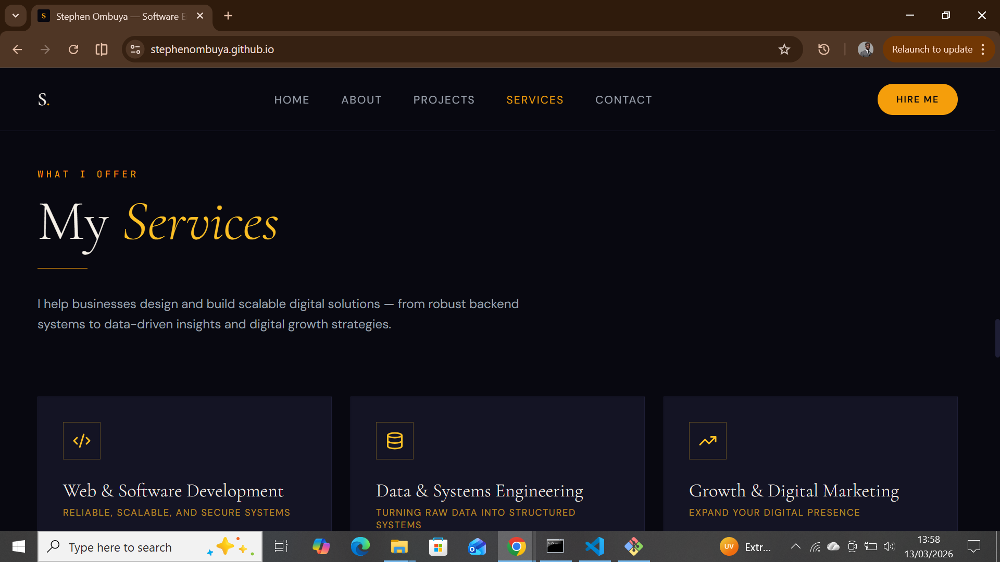

<h1 align="center">
  
</h1>

    Hi, I'm Stephen Ombuya 👋  
🚀 Software Engineer | Problem-Solver | Back-End Enthusiast  
💡 Passionate about building consumer-centric, scalable products from scratch  
🌍 Based in Kenya | Open to startup & growth-stage opportunities

<h3 align="center">A <b>Solutions-Oriented Software Engineer</b> from Kenya</h3>

 

**About Me**:

- 👨🏽‍💻 Preview of my skills and experience: [Portfolio](https://stephenombuya.github.io)
- 🌱 I’m currently learning **React**, **TailWind CSS**, and **TypeScript**
- 👯 I’m looking to collaborate on [my GitHub](https://github.com/stephenombuya)
- 💬 Ask me about **Java, Python, Responsive Web Design... or anything [here](https://github.com/stephenombuya/stephenombuya/issues)** I am happy to help!
- ⚡️ Fun-Fact: **I like dancing to Amapiano music and having fun**
- 📫 How to reach me: [michiekaombuya@gmail.com](mailto:michiekaombuya@gmail.com)
- 📝 [Resume](https://docs.google.com/document/d/1lrcTmxPZXOIbGlYXSokRTRpZ3u5eiQ_HYfUVJs1TUcI/edit?usp=sharing)

  

 

 
  
  
  

 

  

 <h2 align="center">🌐 Portfolio Preview</h2>

  

    
  

  

    <b>Click the image to visit the live portfolio</b>
  

 

 
<h2 align="center">⚒️ Languages-Frameworks-Tools ⚒️</h2>
 

### 💻 Frontend / Web

### 🖥️ Backend / Server

### 🗄️ Databases

### 📝 Programming Languages

### 🛠️ Dev Tools & IDEs

### ☁️ Version Control & Deployment

### 🖧 Operating Systems & Shell

### 🌐 Social / Networking

  
  
 

  <h2>🐍 My Contributions 🐍</h2>
   
  
  
     

  
  

<h2 align="center">⚡ Stats ⚡</h2>
 

    

 
 
 
 
   

 
 

☕ Like my work?
     
     
    

 
