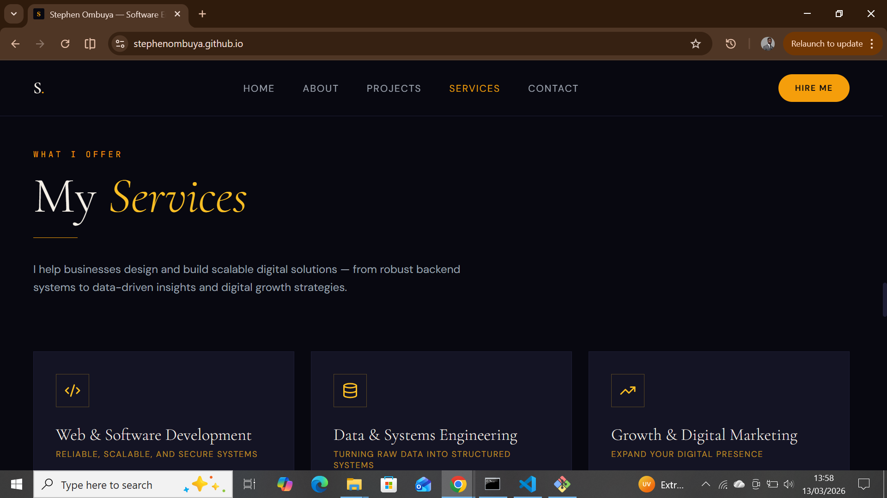

<!-- Repository Analytics -->

<h1 align="center">
  
</h1>

  <b>Software Engineer • Backend-Focused • Systems Thinker</b>

  I design and build scalable, production-ready systems from scratch. 
  Focused on clean architecture, performance, and solving real-world problems with code.

   Kenya •  Open to startup & growth-stage opportunities

---

##  About Me

-  I build systems — not just features
-  Strong focus on **backend engineering & scalable architectures**
-  I turn ideas into **reliable, working products**
-  I care about **clean code, performance, and maintainability**
-  Always learning, always improving

---

##  Links

-  [Portfolio](https://stephenombuya.github.io)
-  [Resume](https://docs.google.com/document/d/1lrcTmxPZXOIbGlYXSokRTRpZ3u5eiQ_HYfUVJs1TUcI/edit?usp=sharing)
-  [Email](michiekaombuya@gmail.com) 

---

##  Tech Stack

###  Frontend

###  Backend

###  Databases

###  Languages

###  Tools

###  DevOps & Deployment

---

##  Portfolio

  

  <b>Click to explore my work</b>

---

##  GitHub Stats

    

---

##  Contributions

  

---

##  Support

If you like what I build:

  

